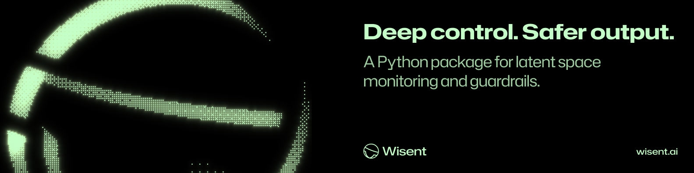

  

  <code>pip install wisent</code>

## Overview

Wisent allows you to control your AI by identifying brain patterns corresponding to responses you don't like, like hallucinations or harmful outputs. We use contrastive pairs of representations to detect when a model might be generating harmful content or hallucinating. Learn more at [wisent.ai/documentation](https://www.wisent.ai/documentation).  

## License

This project is licensed under the MIT License - see the LICENSE file for details. 
